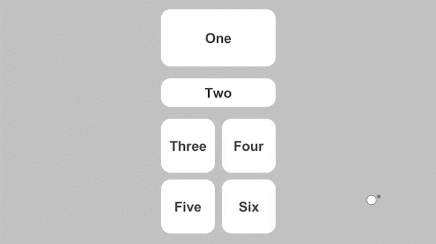

# TouchFree Tooling Examples for Unity

Examples of touchless content only possible through using [TouchFree Unity Tooling](https://developer.leapmotion.com/touchfree-tooling-unity).

## Setup

1. Ensure that the [TouchFree Service](https://docs.ultraleap.com/touchfree-user-manual/#touchfree-service) is running. [Download the installer here](https://developer.leapmotion.com/touchfree).
2. Clone the repo and open the Unity project
3. Open the scene file in the example directory

These examples are best viewed fullscreen.
Tested with Unity 2019.4.22f1

## Animated Progress Buttons

This example shows a button style that provides visual feedback showing when and where the user is going to interact with the UI. This is achieved through animation applied to the button that reacts to the `ProgressToClick` value provided by TouchFree. The result is a UI that feels connected to the movement of your hand.

Recommended Interaction: AirPush

## Soft Snapping

This example shows a Soft Snapping plugin which makes it more likely that a cursor will be over a nearby button, once on a button it also makes it more likely to stay on the button. This version of snapping tries to avoid visually jumping the cursor from button to button. This GIF includes a black dot that represents the original cursor position as a guide.

## Magnetic Snapping

This example shows a Magnetic Snapping plugin which makes it more likely that a cursor will be over a nearby button. Once on a button, the user has free movement over the button. This GIF includes a black dot that represents the original cursor position as a guide.

