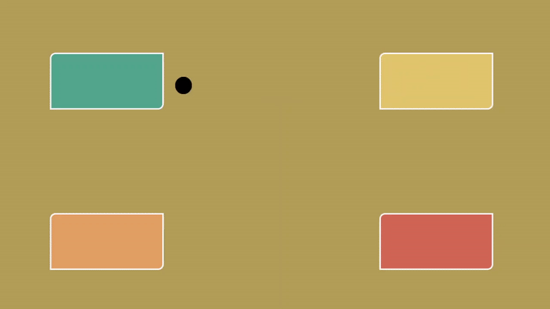

# TouchFree Tooling Examples for Web

Examples of touchless content only possible through using [TouchFree Web Tooling](https://developer.leapmotion.com/touchfree-tooling-for-web).

## Setup

Wave Progress Button is set up slightly differently as it is a react app. The WaveProgressButton folder contains a readme on how to setup that example.

1. Ensure that the [TouchFree Service](https://docs.ultraleap.com/touchfree-user-manual/#touchfree-service) is running. [Download the installer here](https://developer.leapmotion.com/touchfree).
2. Clone the repo and find the example you want to try
3. Open the include html file in your browser

These examples are best viewed fullscreen.

### TouchFree Web Tooling Integration

Several examples use an [NPM workspace](https://docs.npmjs.com/cli/v9/using-npm/workspaces?v=true) to integrate TouchFree Web Tooling as a submodule from `TouchFreeWebTooling` while others include a bundled version of tooling. When integrating the tooling into your own project there are a couple of ways we recommend:

1. JS Bundle
   - A single `TouchFree_Tooling.js` bundle file available as a [download on the Ultraleap website](https://developer.leapmotion.com/touchfree-tooling-for-web).
   - Steps to add this to a website are shown in the [documentation site](https://docs.ultraleap.com/touchfree-user-manual/tooling-for-web.html#add-touchfree-tooling-in-one-minute).
2. NPM Workspace with Git Submodule
   - Create a root package.json in a project folder (above both the submodule and your project) and add your project’s package.json and TouchFree Web Tooling package.json as workspaces within. See the official npm workspaces docs for more details.
   - As an example, this repository has a workspaces package.json. Note that you cannot reuse this file in your project as root-level package.json files are not nestable.
   - NOTE: Webpack doesn't seem to work with this method
3. Integrating with Git URL
   - Use TouchFree Web Tooling as an NPM package retrieved from the [GitHub repository](https://github.com/ultraleap/TouchFreeWebTooling).

## Hover Buttons

This example shows you the most basic way to add hover states to your UI using `pointerEnter` and `pointerExit` events.

Recommended Interaction: AirPush

## Animated Progress Buttons

These examples show button styles that provide visual feedback showing when and where the user is going to interact with the UI. This is achieved through animation applied to the button that reacts to the `ProgressToClick` value provided by TouchFree. The result is a UI that feels connected to the movement of your hand.

### Circular Progress Animation

Recommended Interaction: AirPush

### Linear Progress Animation

Recommended Interaction: Hover & Hold

### Wave Progress Animation

Recommended Interaction: Hover & Hold

### Border Progress Animation

Recommended Interaction: AirPush
